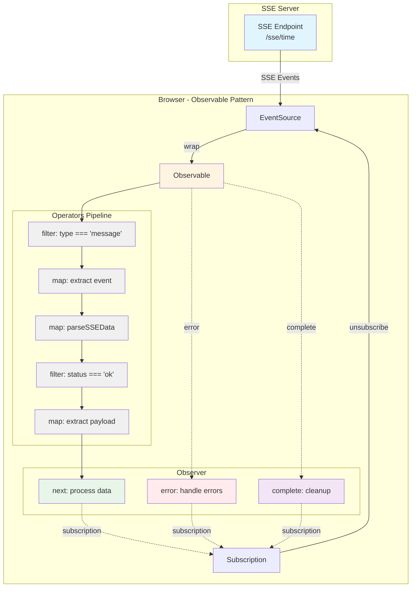
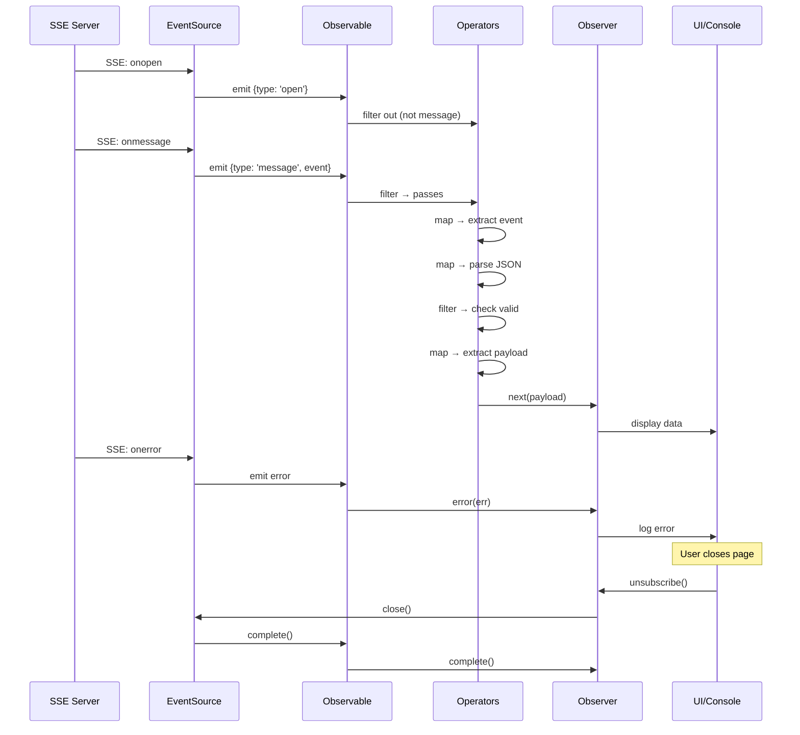
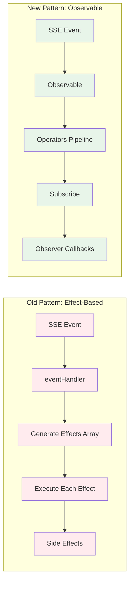
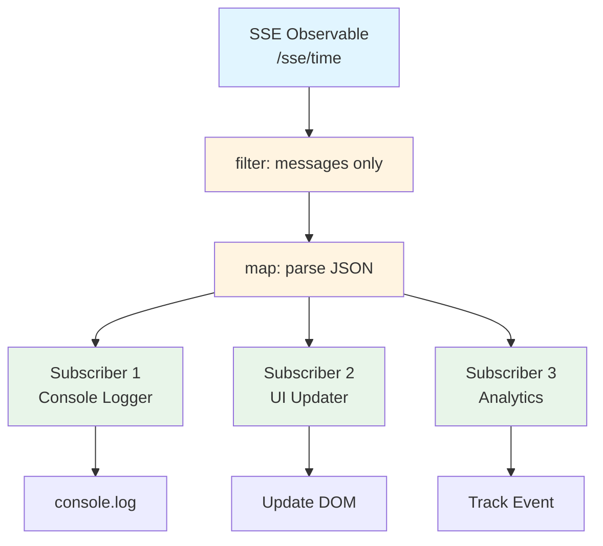
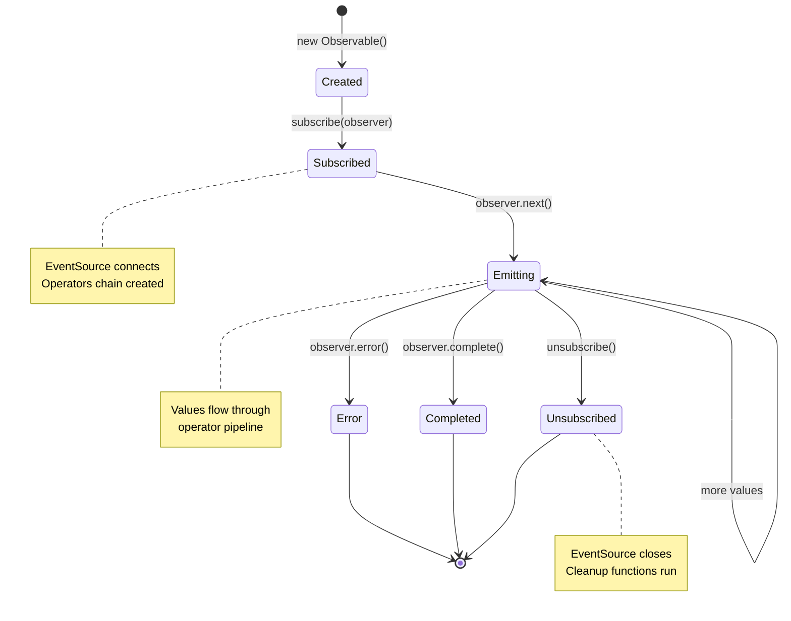
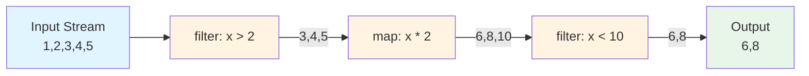

# Observable Pattern Architecture - Visual Guide

This document provides visual representations of the Observable pattern implementation for Server-Sent Events (SSE).

## 1. Main Architecture

The core architecture shows how data flows from the SSE server through the Observable pattern to the Observer.



**Key Components:**
- **SSE Server**: Sends events via Server-Sent Events
- **EventSource**: Browser API that receives SSE events
- **Observable**: Wraps EventSource and provides operator chaining
- **Operators Pipeline**: Transform and filter data (map, filter)
- **Observer**: Consumes the processed data with callbacks (next, error, complete)
- **Subscription**: Manages the connection and cleanup

---

## 2. Observable Data Flow (Sequence)

This sequence diagram shows the temporal flow of events from server connection to cleanup.



**Event Flow:**
1. Connection opens (onopen)
2. Server sends messages (onmessage)
3. Data flows through operator pipeline
4. Observer callbacks process final data
5. Errors are handled gracefully (onerror)
6. Cleanup happens on unsubscribe

---

## 3. Pattern Comparison

Visual comparison between the old effect-based pattern and the new Observable pattern.



**Advantages of Observable Pattern:**
- More declarative and composable
- Better error handling
- Easier to test
- Standard observer interface
- Operator chaining for transformations

---

## 4. Multiple Subscribers Pattern

Demonstrates how one Observable can serve multiple independent subscribers.



**Use Cases:**
- **UI Updates**: Display data on the page
- **Logging**: Console or remote logging
- **Analytics**: Track events and metrics
- **State Management**: Update application state

---

## 5. Observable Lifecycle

State diagram showing all possible states and transitions of an Observable.



**States:**
- **Created**: Observable instantiated but not subscribed
- **Subscribed**: Observer connected, EventSource opened
- **Emitting**: Actively sending values through pipeline
- **Error**: Stream encountered an error and terminated
- **Completed**: Stream finished normally
- **Unsubscribed**: Manually disconnected and cleaned up

---

## 6. Operator Chaining Example

Concrete example showing how data transforms through chained operators.



**Pipeline Steps:**
1. **Input**: `[1, 2, 3, 4, 5]`
2. **Filter (x > 2)**: `[3, 4, 5]`
3. **Map (x * 2)**: `[6, 8, 10]`
4. **Filter (x < 10)**: `[6, 8]`
5. **Output**: `[6, 8]`

**Code Example:**
```javascript
const stream$ = createObservable([1, 2, 3, 4, 5])
  .filter(x => x > 2)
  .map(x => x * 2)
  .filter(x => x < 10)
  .subscribe(console.log); // Outputs: 6, 8
```

---

## Color Legend

All diagrams follow a consistent color scheme:

| Color | Hex Code | Usage |
|-------|----------|-------|
| 🔵 Blue | `#e1f5ff` | Source/Input (Server, EventSource, Input data) |
| 🟡 Yellow | `#fff4e1` | Processing/Operators (Observable, Filters, Maps) |
| 🟢 Green | `#e8f5e9` | Success/Output (Observers, Subscribers, Results) |
| 🔴 Red | `#ffebee` | Errors or deprecated patterns |
| 🟣 Purple | `#f3e5f5` | Completion/Lifecycle events |
| ⚪ Gray | `#f0f0f0` | Pipeline/Processing steps |

---

## Related Documentation

- **[Observable Pattern Guide](OBSERVABLE_PATTERN.md)** - Complete documentation
- **[Quick Reference](QUICK_REFERENCE.md)** - Cheat sheet for daily use
- **[Refactor Summary](OBSERVABLE_REFACTOR.md)** - Migration information
- **[Code Examples](../public/javascripts/sse-observable-examples.js)** - Working examples
- **[Tests](../test/observable.test.js)** - Test suite

---

## Viewing These Diagrams

### In VS Code

1. Install the **Mermaid Preview** extension
2. Open this file
3. Click the preview icon or use Command Palette: "Mermaid: Preview Diagram"

### Online

Copy any diagram code block and paste into [Mermaid Live Editor](https://mermaid.live/)

### In Documentation

These diagrams are embedded in markdown and will render automatically in:
- GitHub
- GitLab
- VS Code (with Mermaid extension)
- Most modern markdown viewers

---

## Individual Diagram Files

For easier editing and reuse, each diagram is also available as a standalone `.mmd` file:

- [`diagrams/observable-architecture.mmd`](diagrams/observable-architecture.mmd)
- [`diagrams/observable-dataflow.mmd`](diagrams/observable-dataflow.mmd)
- [`diagrams/pattern-comparison.mmd`](diagrams/pattern-comparison.mmd)
- [`diagrams/multiple-subscribers.mmd`](diagrams/multiple-subscribers.mmd)
- [`diagrams/observable-lifecycle.mmd`](diagrams/observable-lifecycle.mmd)
- [`diagrams/operator-chaining.mmd`](diagrams/operator-chaining.mmd)

See [`diagrams/README.md`](diagrams/README.md) for more information about editing and using these diagrams.
